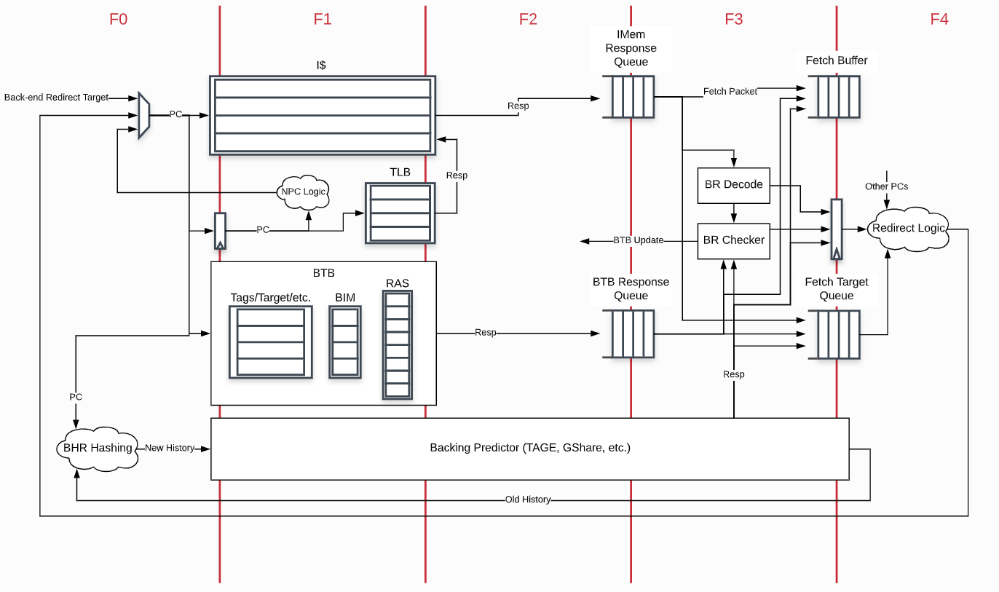

## Boom 笔记

### 	一些名词

- ***PTW*** : Page Table Walker
- ***TLB*** : Translation Look-aside Buffer
- CSR
- ***LSU*** : Load/Store Unit
- ***l$*** : 
- ***D$(HC)*** : 
- ***darb*** : 
- ***dcshim***

### Introduction

- ##### Boom简介	

  - Boom受***MIPS R10000*** 和 ***Alpha 21264*** 的启发很大，都是**乱序发射**，也用到了**寄存器重命名技术**	
  - Boom实现的是开源的***RISCV ISA***，利用***Chisel***编写.
  - ***Boom***将***Rocket-chip Soc generator***用作一个库，这样可以重复使用一些***micro-architecture structure***，如TLB，PTW
  - 两篇文章
    - Yeager, Kenneth C. “The MIPS R10000 superscalar microprocessor.” IEEE micro 16.2 (1996): 28-41
    - Kessler, Richard E. “The alpha 21264 microprocessor.” IEEE micro 19.2 (1999): 24-36.

- #####   Boom流水线

  Boom 理论上分为10级，但在实际实现时有些已经合并在了一起，所以流水线共7级：

  - ***Fetch*** : 从指令内存中读取指令并放入到FIFO queue即***Fetch Buffer***中。***Branch Prediction***也在这一级，有时会重定向取的指令。
  - ***Decode/Rename***
    - ***Decode*** : 从***Fetch Buffer***中去指令，并生成相应的**微操作码**(***Micro-Op, UOP***)
    - ***Rename*** : 将逻辑的寄存器描述符(r1 - r31)重命名为到实际的物理寄存器描述符
  - ***Rename/Dispatch***
    - ***Dispatch*** : 将**微操作码**（***UOP***）分派或写入到一组提交队列中(***a set of Issue Queues***)
  - ***Issue/RegisterRead*** 
    - ***Issue*** : 在提交队列中的***UOP***等待他们的**操作数**（***operands***）准备好了，然后就可以发射了。这是乱取流水线的开端
    - ***RegisterRead*** : 发射***UOP***首先要做的从统一的**物理寄存器**或者从**旁路网络**（***Bypass Network***）读取寄存器操作数
  - ***Execute*** : 发射出的内存操作在**执行阶段**(***Execute Stage***)计算其地址，然后将计算出来的地址存储在**内存阶段**(***Memory Stage***)的***Load/Store Unit*** 单元
  - ***Memory*** : ***Load/Store Unit***包括三个队列 :  ***Load Address Queue(LAQ)***、***Store Address Queue(SAQ)***和***Store Data Queue(SDQ)***。当加载的地址存在了***LAQ***中时，会将***Loads***激发到（***fired***）内存中，***Store***在Commit时将被激发到内存中（一般情况下，***Store***的地址和数据都放置在***SAQ***和***SDQ***中之后才能提交***Store***）
  - ***Writeback*** : ***ALU*** 结果或***Load***结果被写回到**物理寄存器**（***Physical Register File***）中

> ***Commit*** :  ***Reorder Buffer(ROB)*** 追踪流水线中每条指令的状态，当ROB的首部不忙时，ROB提交指令。***ROB*** 向**Store 队列**（***SAQ/SDQ***）前面的store发信号表明它可以向内存中写数据了。
>
> *hint* : 因为***Commit***在流水线中是异步的，所以***Commit***不能算作一个流水级（Pipeline Stage）

- ##### 分支支持

  ***BOOM***支持完整的**分支推测**（***branch speculation***）和分支预测（***branch prediction***），每条指令（无论其在流水线中的什么位置）都会带有一个分支标记（***Branch Tag***），标记该指令在哪个分支下被推测。预测错误的分支需要终止依赖该分支的所有指令，当分支指令通过***Rename***时将会复制***Register Rename Table***和***Free List***。当预测错误时，将回复保存时的处理器状态。

  

- ##### Chisel硬件描述语言

  - Chisel训练营：[chisel-bootcamp](https://github.com/freechipsproject/chisel-bootcamp) （[所有代码](https://github.com/likmin/chisel3-bootcamp)）
  - Chisel官方文档：http://chisel-lang.org/
  - Chisel-cheatcheet：https://github.com/freechipsproject/chisel-cheatsheet/

- ##### RISC-V ISA

  RISC-V ISA 的以下几个特点比较适合高性能模型

  - **弱一致性内存模型**（***Relaxed Memory Model***）	

    这样极大的简化**加载/存储单元** ***LSU***，它不需要让***loads***探听（snoop）其他***loads***，也不需要一致性流量探听（snoop）LSU，这些都是顺序一致性的要求。

  - **Accrued Floating Point（FP） exception flags**

    浮点状态寄存器不需要重命名，浮点指令也不会产生例外

  - **没有整型副作用（*No integer side-effects*）**

    除了写入目标寄存器外，所有的整数ALU运算都没有副作用，这避免了需要重命名其他条件状态。

  - **没有cmov或预测**

    虽然预测会降低小型设计分支预测器的复杂度，但他会使无序流水线大大复杂化，包括为整数运算添加第三个读取端口

  - **没有隐含的寄存器描述符（*No implicit register specifiers*）**

    即使***JAL***要求指出一个明确寄存器，这简化了重命名逻辑（Rename logic），从而避免了在访问重命名表之前首先需要了解指令的情况，或者避免了添加更多端口以消除关键路径上的指令解码（decode off）

  - ***rs1, rs2, rs3, rd*** **寄存器始终在同一个位置**

    这样便可以并行解码和重命名

- ##### Rocket Chip Soc Generator

             
一个没有L2Cache的单核的"Boom-chip"
 

​		因为BOOM只是一个核心（core），所以需要一个完整的SoC基础架构，BOOM用开源的 [Rocket Chip SoC generator](https://github.com/chipsalliance/rocket-chip)开发的，**Rocket Chip generator**可以实现各种SoC设计：多块告诉缓存的一致性设计，带有或不带有加速器的内核，带有或不带有最后一级的共享高速缓存的芯片。**Rocket Chip generator**默认情况下和一个称为**Rocket**的5级顺序流水的内核绑定。BOOM利用Rocket Chip的基础架构去实现其自己的core/tile(tile is a core, L1D/I$, and PTW)而不是用Rocket tile。

​		从BOOM的观点，Rocket core可以被认为是一个处理组成元素的库，这里有很多模块是为Rocket创造的但同样适用于BOOM，例如：functional units，Cache，TLB（快表，The Translation look-aside buffers），PTW（The Page Table Walker）等等。

​		更多参考消息： [Chipyard Rocket Chip documentation](https://chipyard.readthedocs.io/en/dev/Generators/Rocket-Chip.html).

​									[Chipyard Rocket Core documentation](https://chipyard.readthedocs.io/en/dev/Generators/Rocket.html).

### Code OVERVIEW

1. ##### 取指令（***Instruction Fetch***）

   

   
             
BOOM前端
 

   ​		和Rocket core一样，BOOM也有自己的前端（front-end）。该前端提取指令，并在整个Fetch阶段（fetch stage）进行预测，以便在多个Fetch周期（F0,F1...）中重定向指令流。如果在BOOM的后端监测到一个错误预测，或者BOOM自己的一个预测器想要重定向流水线到一个不同方向，一个请求将发送到前端，然后开始从一个新的指令路径取指令。更多分支预测器是如何工作的可以查看Fetch阶段流水线的Branch Prediction。

   ​		因为BOOM支持超标量的(superscalar)fetch，前端从**指令内存**中检索一个**Fetch Packet**，然后将他们存入**Fetch Buffer**中以便后续的流水线使用。**Fetch Packet**中同样包含其他元数据（meta-data），例如valid和一些用于流水线后面要用到分支预测信息。另外，PC和分支预测信息被存储在Fetch Targe Queue中，Fetch Target Queue为后续的流水线保留着信息。

   

   - ***The Rocket Core I-Cache***

     Boom的icache取自Rocket processor源代码中，采用了**虚地址实标识组相连Cache**（***virtually indexed,physically tagged set-associative Cache*** ）

     

     为了节约能量，***i-cache***会读出固定数量的字节（对齐的）并将指令为存储到寄存器中，后续的指令提取可通过该寄存器进行管理。当提取寄存器用完以后或分支预测器将PC定向到其他位置后，才会再次启动该***i-cache***。

     

     现在***i-cache***不支持跨高速缓存行（Cache-line）的提取，也不支持有关超标量提取地址的非对齐取(fetching unaligned)。

     > 因为一个高速缓存行（Cache-line）并没有存储在存储体的单行中，而是在单个存储体中进行了条带化，以匹配来自非核心的重新填充大小。
     >
     > 获取非对齐的数据需要修改底层的实现，例如，对i-cache进行存储，以便同时访问缓存行的连续快。

     ***i-cache***也不支持**同时命中和缺失（*hit-and-miss*）**，缺失后，***i-cache***会先处理缺失，等处理完毕后再去处理其他请求。对于分支预测器发现预测错误并且希望***i-cache***以正确的路径提取的场景，这并不理想。

     

   - ***Fetching Compressed Instructions***

     ​		BOOM中实现了RISC-V中的压缩指令（RISC-V Compressed ISA extension）。拓展的压缩指令集或称RVC可以对常用指令进行较小的16bit编码，以减少静态和动态代码的大小。RVC具有许多微架构师特别感兴趣的功能：

     - 32bit的指令没有对齐要求的话，可能会从一个**半字边界**（***half boundary***）开始。
     - 所有的16bit指令直接映射到一个更长的32bit的指令。

     ​		

     ​		在前端阶段，BOOM从i-cache中检索到一个Fetch Packet，为了分支预测会迅速解析该指令，并将Fetch Packet压入Fetch Buffer。然后这样做会带来一些列问题需要处理：

     - 增加解码的复杂性（现在操作数到处移动）
     - 查找指令的开始位置
     - 在整个代码库中删除`+4`假设，尤其是在分支处理中
     - 非对齐指令，特别是耗尽缓存行和虚拟页面的指令

     

     ​		最后一点在Fetch单元需要一个额外的“有状态性”，因为获取指令的所有部分可能需要多个周期。

     下面将通过描述一个指令生存期来描述BOOM中RVC的实现。

     

     - 前端返回一个`fetchWidth * 16bit`宽度的Fetch Packet，这是由BOOM前端内在支持的。
     - 在**F3**保留有状态性，在**F3**中Fetch Packet从i-cache的response队列中出队列，并进队列到Fetch Buffer中。
     - **F3**跟踪最后一个Fetch Packet的尾随16bit，PC和指令边界。这些组成了当前的Fetch Packet并且扩展成fetchWidth * 32bits进入Fetch Buffer中。提前解码可以决定在这个Fetch Packet中的每一个指令的起始地址，并且对Fetch Buffer隐藏Fetch Packet
     - 现在，当将Fetch Buffer存储到其内存中时，它总会压缩无效或不对齐的指令

     

     以下部分描述了其他实现细节：

     - 一个具有挑战性的问题是处理跨越FetchBoundary的指令，我们将这些指令跟踪为属于包含其高阶16bit的Fetch Packet的指令（这是人话？），当决定到这些指令的PC时我们必须小心，f方法就是跟踪所有最初在Fetch Boundary上未对齐的指令。

       

   - ***The Fetch Buffer***

     ***Fetch Packet***从***i-cache***中提取，然后放入到***Fetch Buffer***中，***Fetch Buffer***将Back-end的执行流水段和Front-end的指令存取端**解耦合(*decouple*)**。

     ***Fetch Buffer***是参数化的：条目数是可以更改的，缓冲区是否可以实现**直通*flow-through***队列也是可以自定义的。

     > 当队列为空且消费者正在请求时，一个直通式队列（flow-through queue）允许entries可以进队列后立刻出队列，

     

   - ***The Fetch Target Queue***

     ​		***The Fetch Targe Queue***是一个保留从i-cache中获取到PC和与该地址相关的分支预测信息的队列。他会保留这些信息以供流水线在其在执行**Micro-Ops（UOPs）**期间参考（reference），一旦一个指令被提交，它就会由***ROB***出队，并在流水线重定向/错误推测期间进行更新。

     

2. ##### 分支预测（*Branch Prediction*）

   Boom中用了两级分支预测器，一个是较快的***Next-Line Predictor（NLP）***和一个较慢的但是更复杂的***Backing Predictor（BPD）***。其中***NLP***是一个**分支目标缓存**，***BPD***是一个更复杂的类似***GShare***的结构预取器。

   > 不幸的是，文献中的术语在所谓的分支预测遍历的不同类型和级别上有些混乱，文献中已经提到了不同中结构；“Micro-BTB”  vs “BTB”，“NLP” vs "BHT", 和“cache-line predictor” vs ”overriding predictor“。尽管Rocket core称其自己的预测器为BTB，但BOOM则将其称为下一行预测器（Next-Line Predictor，NLP），这是为了说明他是组合逻辑的预测器，为获取下一行指令提供单周期的预测，并且Rocket BTB包含的复杂性远远超过分支目标缓冲区结构。同样，Backing Predictor（BPD）名字的选择是为了避免过分描述内部设计（是否是过于简单的BHT？是否已标记？是否会覆盖NLP），同时保持准确。

   

   - The Next-Line Predictor（NLP）

     ​		BOOM核心的**前端（*Front-end*）**取指令，并在每个周期都会预测下一条指令的位置，如果在BOOM的后端发现预测失败或者BOOM自己的Backing Predictor（BPD）想要重定向流水线，一个请求将发送到**前端（*Front-end*）**并开始沿一个新的指令路径取指令。

     ​		NLP利用当前取指令的PC，并利用组合电路预测下一个周期该在哪里取指令，如果预测的正确，这里应该没有流水线气泡

     ​		NLP是一个**全相连的分支目标缓存（*Branch Target Buffer，BTB*）**，**双模表（*Bi-Modal Table，BIM*）**和一个**返回地址栈（*Return Address Stack，RAS*）**，这些工作在一起构成了一个快速的但精确度还可以的分支预测器。

     

     - NLP Predictions

       取指令首先为了找到匹配的BTB条目，执行标签匹配。如果命中，BTB条目将会与RAS一起预测在Fetch Packet中是否存在分支，跳转或返回，以及硬归咎于Fetch Packet的那一条指令。BIM用于决定所做的预测是否发生分支，BTB中童谣包含着一个预测的PC目标，经常用于下一个周期获取PC值。

       
             
Next-Line Predictor(NLP)单元，取指令的PC扫描BTB的tag，如果有相应的条目（entry）与之匹配并且该条目是有效的（valid），那最后的裁决会参考BIM和RAS。如果该条目（entry）是一个“ret”（return instruction），那么最终的目标将来自RAS。如果该条目（entry）是一个无状态的“jmp”（jump instruction），那将不会参考BIM。“bidx”或称branch index（分支索引标记），将会标记超标量Fetch Packet那条指令时控制流预测造成的，很有必要去标记Fetch Packet中的其他来自分支之后的指令。
           
 

        

       如果预测指令是分支，则仅在BTB条目中命中是使用BIM的滞后位。

       如果BTB条目包含一个返回指令，RAS栈会被用来提供预测的返回PC用作下一个取址PC。实际的RAS的管理（何时到达或堆栈）是由外部控制的。为了面积效率，号位的PC-tags和PC目标被存储在了一个压缩的文件中。

       

     - NLP Updates

       每一个传递到流水线中的分支不仅保留着它自己的PC，同时保留着其Fetch PC（Fetch Packet起始指令的PC）

       > 事实上，只有最低位或者最高位被保留

       - BTB Updates

         

       - RAS Updates

       - Superscalar Predictions

   - The Backing Predictor(BPD)

   

3. 

