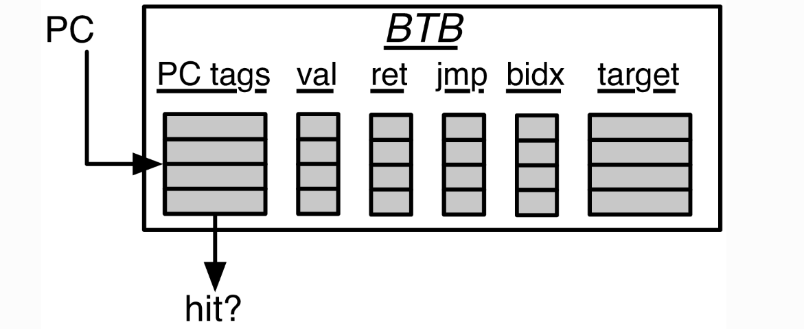

## Boom 笔记

### 	一些名词

- ***PTW*** : Page Table Walker
- ***TLB*** : Translation Look-aside Buffer
- CSR
- ***LSU*** : Load/Store Unit
- ***l$*** : 
- ***D$(HC)*** : 
- ***darb*** : 
- ***dcshim***


### Introduction

- ##### Boom简介	

  - Boom受***MIPS R10000*** 和 ***Alpha 21264*** 的启发很大，都是**乱序发射**，也用到了**寄存器重命名技术**	
  - Boom实现的是开源的***RISCV ISA***，利用***Chisel***编写.
  - ***Boom***将***Rocket-chip Soc generator***用作一个库，这样可以重复使用一些***micro-architecture structure***，如TLB，PTW
  - 两篇文章
    - Yeager, Kenneth C. “The MIPS R10000 superscalar microprocessor.” IEEE micro 16.2 (1996): 28-41
    - Kessler, Richard E. “The alpha 21264 microprocessor.” IEEE micro 19.2 (1999): 24-36.


- #####   Boom流水线

  Boom 理论上分为10级，但在实际实现时有些已经合并在了一起，所以流水线共7级：

  - ***Fetch*** : 从指令内存中读取指令并放入到FIFO queue即***Fetch Buffer***中。***Branch Prediction***也在这一级，有时会重定向取的指令。
  - ***Decode/Rename***
    - ***Decode*** : 从***Fetch Buffer***中去指令，并生成相应的**微操作码**(***Micro-Op, UOP***)
    - ***Rename*** : 将逻辑的寄存器描述符(r1 - r31)重命名为到实际的物理寄存器描述符
  - ***Rename/Dispatch***
    - ***Dispatch*** : 将**微操作码**（***UOP***）分派或写入到一组提交队列中(***a set of Issue Queues***)
  - ***Issue/RegisterRead*** 
    - ***Issue*** : 在提交队列中的***UOP***等待他们的**操作数**（***operands***）准备好了，然后就可以发射了。这是乱取流水线的开端
    - ***RegisterRead*** : 发射***UOP***首先要做的从统一的**物理寄存器**或者从**旁路网络**（***Bypass Network***）读取寄存器操作数
  - ***Execute*** : 发射出的内存操作在**执行阶段**(***Execute Stage***)计算其地址，然后将计算出来的地址存储在**内存阶段**(***Memory Stage***)的***Load/Store Unit*** 单元
  - ***Memory*** : ***Load/Store Unit***包括三个队列 :  ***Load Address Queue(LAQ)***、***Store Address Queue(SAQ)***和***Store Data Queue(SDQ)***。当加载的地址存在了***LAQ***中时，会将***Loads***激发到（***fired***）内存中，***Store***在Commit时将被激发到内存中（一般情况下，***Store***的地址和数据都放置在***SAQ***和***SDQ***中之后才能提交***Store***）
  - ***Writeback*** : ***ALU*** 结果或***Load***结果被写回到**物理寄存器**（***Physical Register File***）中

> ***Commit*** :  ***Reorder Buffer(ROB)*** 追踪流水线中每条指令的状态，当ROB的首部不忙时，ROB提交指令。***ROB*** 向**Store 队列**（***SAQ/SDQ***）前面的store发信号表明它可以向内存中写数据了。
>
> *hint* : 因为***Commit***在流水线中是异步的，所以***Commit***不能算作一个流水级（Pipeline Stage）


- ##### 分支支持

  ***BOOM***支持完整的**分支推测**（***branch speculation***）和分支预测（***branch prediction***），每条指令（无论其在流水线中的什么位置）都会带有一个分支标记（***Branch Tag***），标记该指令在哪个分支下被推测。预测错误的分支需要终止依赖该分支的所有指令，当分支指令通过***Rename***时将会复制***Register Rename Table***和***Free List***。当预测错误时，将回复保存时的处理器状态。

  

- ##### Chisel硬件描述语言

  - Chisel训练营：[chisel-bootcamp](https://github.com/freechipsproject/chisel-bootcamp) （[所有代码](https://github.com/likmin/chisel3-bootcamp)）
  - Chisel官方文档：http://chisel-lang.org/
  - Chisel-cheatcheet：https://github.com/freechipsproject/chisel-cheatsheet/

- ##### RISC-V ISA

  RISC-V ISA 的以下几个特点比较适合高性能模型

  - **弱一致性内存模型**（***Relaxed Memory Model***）	

    这样极大的简化**加载/存储单元** ***LSU***，它不需要让***loads***探听（snoop）其他***loads***，也不需要一致性流量探听（snoop）LSU，这些都是顺序一致性的要求。

  - **Accrued Floating Point（FP） exception flags**

    浮点状态寄存器不需要重命名，浮点指令也不会产生例外

  - **没有整型副作用（*No integer side-effects*）**

    除了写入目标寄存器外，所有的整数ALU运算都没有副作用，这避免了需要重命名其他条件状态。

  - **没有cmov或预测**

    虽然预测会降低小型设计分支预测器的复杂度，但他会使无序流水线大大复杂化，包括为整数运算添加第三个读取端口

  - **没有隐含的寄存器描述符（*No implicit register specifiers*）**

    即使***JAL***要求指出一个明确寄存器，这简化了重命名逻辑（Rename logic），从而避免了在访问重命名表之前首先需要了解指令的情况，或者避免了添加更多端口以消除关键路径上的指令解码（decode off）

  - ***rs1, rs2, rs3, rd*** **寄存器始终在同一个位置**

    这样便可以并行解码和重命名


- ##### Rocket Chip Soc Generator

<center>        <br>    <div style="color:orange; border-bottom: 1px solid #d9d9d9;    display: inline-block;    color: #999;    padding: 2px;">一个没有L2Cache的单核的"Boom-chip"</div> </center>


​		因为BOOM只是一个核心（core），所以需要一个完整的SoC基础架构，BOOM用开源的 [Rocket Chip SoC generator](https://github.com/chipsalliance/rocket-chip)开发的，**Rocket Chip generator**可以实现各种SoC设计：多块告诉缓存的一致性设计，带有或不带有加速器的内核，带有或不带有最后一级的共享高速缓存的芯片。**Rocket Chip generator**默认情况下和一个称为**Rocket**的5级顺序流水的内核绑定。BOOM利用Rocket Chip的基础架构去实现其自己的core/tile(tile is a core, L1D/I$, and PTW)而不是用Rocket tile。

​		从BOOM的观点，Rocket core可以被认为是一个处理组成元素的库，这里有很多模块是为Rocket创造的但同样适用于BOOM，例如：functional units，Cache，TLB（快表，The Translation look-aside buffers），PTW（The Page Table Walker）等等。

​		更多参考消息： [Chipyard Rocket Chip documentation](https://chipyard.readthedocs.io/en/dev/Generators/Rocket-Chip.html).

​									[Chipyard Rocket Core documentation](https://chipyard.readthedocs.io/en/dev/Generators/Rocket.html).


### Code OVERVIEW


1. ##### 取指令（***Instruction Fetch***）

   

   <center>        <br>    <div style="color:orange; border-bottom: 1px solid #d9d9d9;    display: inline-block;    color: #999;    padding: 2px;">BOOM前端</div> </center>

   ​		和Rocket core一样，BOOM也有自己的前端（front-end）。该前端提取指令，并在整个Fetch阶段（fetch stage）进行预测，以便在多个Fetch周期（F0,F1...）中重定向指令流。如果在BOOM的后端监测到一个错误预测，或者BOOM自己的一个预测器想要重定向流水线到一个不同方向，一个请求将发送到前端，然后开始从一个新的指令路径取指令。更多分支预测器是如何工作的可以查看Fetch阶段流水线的Branch Prediction。

   ​		因为BOOM支持超标量的(superscalar) fetch，前端从**指令内存**中检索一个**Fetch Packet**，然后将他们存入**Fetch Buffer**中以便后续的流水线使用。**Fetch Packet**中同样包含其他元数据（meta-data），例如valid和一些用于流水线后面要用到分支预测信息。另外，PC和分支预测信息被存储在Fetch Targe Queue中，Fetch Target Queue为后续的流水线保留着信息。

   

   - ***The Rocket Core I-Cache***

     Boom的icache取自Rocket processor源代码中，采用了**虚地址实标识组相连Cache**（***virtually indexed,physically tagged set-associative Cache*** ）

     

     为了节约能量，***i-cache***会读出固定数量的字节（对齐的）并将指令为存储到寄存器中，后续的指令提取可通过该寄存器进行管理。当提取寄存器用完以后或分支预测器将PC定向到其他位置后，才会再次启动该***i-cache***。

     

     现在***i-cache***不支持跨高速缓存行（Cache-line）的提取，也不支持有关超标量提取地址的非对齐取(fetching unaligned)。

     > 因为一个高速缓存行（Cache-line）并没有存储在存储体的单行中，而是在单个存储体中进行了条带化，以匹配来自非核心的重新填充大小。
     >
     > 获取非对齐的数据需要修改底层的实现，例如，对i-cache进行存储，以便同时访问缓存行的连续快。

     ***i-cache***也不支持**同时命中和缺失（*hit-and-miss*）**，缺失后，***i-cache***会先处理缺失，等处理完毕后再去处理其他请求。对于分支预测器发现预测错误并且希望***i-cache***以正确的路径提取的场景，这并不理想。

     

   - ***Fetching Compressed Instructions***

     ​		BOOM中实现了RISC-V中的压缩指令（RISC-V Compressed ISA extension）。拓展的压缩指令集或称RVC可以对常用指令进行较小的16bit编码，以减少静态和动态代码的大小。RVC具有许多微架构师特别感兴趣的功能：

     - 32bit的指令没有对齐要求的话，可能会从一个**半字边界**（***half boundary***）开始。
     - 所有的16bit指令直接映射到一个更长的32bit的指令。

     ​		

     ​		在前端阶段，BOOM从i-cache中检索到一个Fetch Packet，为了分支预测会迅速解析该指令，并将Fetch Packet压入Fetch Buffer。然后这样做会带来一些列问题需要处理：

     - 增加解码的复杂性（现在操作数到处移动）
     - 查找指令的开始位置
     - 在整个代码库中删除`+4`假设，尤其是在分支处理中
     - 非对齐指令，特别是耗尽缓存行和虚拟页面的指令

     

     ​		最后一点在Fetch单元需要一个额外的“有状态性”，因为获取指令的所有部分可能需要多个周期。

     下面将通过描述一个指令生存期来描述BOOM中RVC的实现。

     

     - 前端返回一个`fetchWidth * 16bit`宽度的Fetch Packet，这是由BOOM前端内在支持的。
     - 在**F3**保留有状态性，在**F3**中Fetch Packet从i-cache的response队列中出队列，并进队列到Fetch Buffer中。
     - **F3**跟踪最后一个Fetch Packet的尾随16bit，PC和指令边界。这些组成了当前的Fetch Packet并且扩展成fetchWidth * 32bits进入Fetch Buffer中。提前解码可以决定在这个Fetch Packet中的每一个指令的起始地址，并且对Fetch Buffer隐藏Fetch Packet
     - 现在，当将Fetch Buffer存储到其内存中时，它总会压缩无效或不对齐的指令

     

     以下部分描述了其他实现细节：

     - 一个具有挑战性的问题是处理跨越FetchBoundary的指令，我们将这些指令跟踪为属于包含其高阶16bit的Fetch Packet的指令（这是人话？），当决定到这些指令的PC时我们必须小心，f方法就是跟踪所有最初在Fetch Boundary上未对齐的指令。

       

   - ***The Fetch Buffer***

     ***Fetch Packet***从***i-cache***中提取，然后放入到***Fetch Buffer***中，***Fetch Buffer***将Back-end的执行流水段和Front-end的指令存取端**解耦合(*decouple*)**。

     ***Fetch Buffer***是参数化的：条目数是可以更改的，缓冲区是否可以实现**直通*flow-through***队列也是可以自定义的。

     > 当队列为空且消费者正在请求时，一个直通式队列（flow-through queue）允许entries可以进队列后立刻出队列，

     

   - ***The Fetch Target Queue***

     ​		***The Fetch Targe Queue***是一个保留从i-cache中获取到PC和与该地址相关的分支预测信息的队列。他会保留这些信息以供流水线在其在执行**Micro-Ops（UOPs）**期间参考（reference），一旦一个指令被提交，它就会由***ROB***出队，并在流水线重定向/错误推测期间进行更新。

     

2. ##### 分支预测（*Branch Prediction*）

   Boom中用了两级分支预测器，一个是较快的***Next-Line Predictor（NLP）***和一个较慢的但是更复杂的***Backing Predictor（BPD）***。其中***NLP***是一个**分支目标缓存**，***BPD***是一个更复杂的类似***GShare***的结构预取器。

   > 不幸的是，文献中的术语在所谓的分支预测遍历的不同类型和级别上有些混乱，文献中已经提到了不同中结构；“Micro-BTB”  vs “BTB”，“NLP” vs "BHT", 和“cache-line predictor” vs ”overriding predictor“。尽管Rocket core称其自己的预测器为BTB，但BOOM则将其称为下一行预测器（Next-Line Predictor，NLP），这是为了说明他是组合逻辑的预测器，为获取下一行指令提供单周期的预测，并且Rocket BTB包含的复杂性远远超过分支目标缓冲区结构。同样，Backing Predictor（BPD）名字的选择是为了避免过分描述内部设计（是否是过于简单的BHT？是否已标记？是否会覆盖NLP），同时保持准确。

   

   - **The Next-Line Predictor（NLP）**

     ​		BOOM核心的**前端（*Front-end*）**取指令，并在每个周期都会预测下一条指令的位置，如果在BOOM的后端发现前面的预测失败了或者BOOM自己的Backing Predictor（BPD）想要重定向流水线，一个请求将发送到**前端（*Front-end*）**并开始沿一个新的指令路径取指令。

     ​		NLP利用当前取指令的PC，并利用组合电路预测下一个周期该在哪里取指令，如果预测的正确，这里应该没有流水线气泡。

     ​		NLP是一个**全相连的分支目标缓存（*Branch Target Buffer，BTB*）**，**双模表（*Bi-Modal Table，BIM*）**和一个**返回地址栈（*Return Address Stack，RAS*）**，这些工作在一起构成了一个快速的但精确度还可以的分支预测器。

     

     - **NLP Predictions**

       取指令首先为了找到匹配的BTB条目，执行标签匹配。如果命中，BTB条目将会与RAS一起预测在Fetch Packet中是否存在分支，跳转或返回，以及硬归咎于Fetch Packet的那一条指令。BIM用于决定所做的预测是否发生分支，BTB中童谣包含着一个预测的PC目标，经常用于下一个周期获取PC值。

       <center>        <br>    <div style="color:orange; border-bottom: 1px solid #d9d9d9;    display: inline-block;    color: #999;    padding: 2px;" align= "justify">Next-Line Predictor(NLP)单元，取指令的PC扫描BTB的tag，如果有相应的条目（entry）与之匹配并且该条目是有效的（valid），那最后的裁决会参考BIM和RAS。如果该条目（entry）是一个“ret”（return instruction），那么最终的目标将来自RAS。如果该条目（entry）是一个无状态的“jmp”（jump instruction），那将不会参考BIM。“bidx”或称branch index（分支索引标记），将会标记超标量Fetch Packet那条指令时控制流预测造成的，很有必要去标记Fetch Packet中的其他来自分支之后的指令。
           </div> </center>

       

       如果预测指令是分支，则仅在BTB条目中命中是使用BIM的滞后位。

       如果BTB条目包含一个返回指令，RAS栈会被用来提供预测的返回PC用作下一个取址PC。实际的RAS的管理（何时到达或堆栈）是由外部控制的。为了面积效率，号位的PC-tags和PC目标被存储在了一个压缩的文件中。

       

     - **NLP Updates**

       每一个传递到流水线中的分支不仅保留着它自己的PC，同时保留着其Fetch PC（Fetch Packet起始指令的PC）

       > 事实上，只有最低位或者最高位被保留

       - **BTB Updates**

         仅当执行阶段的分支单元或Fetch阶段的BPD跳转从定向前端进行分支或跳转时，BTB才会更新。如果没有对应于的采取分支或跳转的BTB条目，那么久为其分配一个新条目。

         > 错误预测下重定向PC时，这种新的Fetch PC与需要写入新BTB条目的目标PC字段中的更新PC相同。这种巧合允许PC亚索表使用单个搜索端口——它可以一边读取该表以进行下一个预测，同时还查看新的更新的PC是否已经为其分配了适当的high-order 位。

       - **RAS Updates**

         在Fetch阶段一旦在Fetch Packet的指令已经被解码，RAS将会更新。如果执行的指令是一个call类型，那么返回地址将被压入RAS。如果执行的指令是一个return类型，将从RAS中弹出一项。

         > 虽然RISC-V并没有指定的call指令，可以通过检查一个写回目标为x1（又名返回地址寄存器）的JAL或JALR指令来推断。

       - **Superscalar Predictions**

         当NLP做一个预测时，实际上是在使用BTB标记与预测分支的Fetch PC匹配，并不是分支自己的PC。NLP必须在整个Fetch Packet中预测许多可能分支中哪一个将成为重定向PC的主要分支。因此，我们使用给定的分支的Fetch PC，而不是BTB标签匹配中自己的PC。

         > 每个BTB条目对应一个单独的Fetch PC，但是会帮助预测整个Fetch Packet。然而，BTB条目只能在控制流指令中存储meta-data和target-data。虽然在这种设计中确实存在损害性能的病态情况，但前提是，相对于Fetch PC，Fetch Packet中的哪个分支是主要分支，并且至少对于窄的Fetch设计而言，对这种设计的评估表明，它非常复杂优化，性能没有明显损失。

   - **The Backing Predictor(BPD)**

     ​		当NLP预测无误的时候，处理器的后端提供一个不间断的指令流去执行。NLP能够提供昂贵的（就面积和功率而言），非常小（仅能记住几十个分支）并且非常简单（双模态表（BIM））的情况下提供一个快速的单周期的预测。但hysteresis bits不能学习非常复杂或较长历史的模式。

     ​		为了捕获到跟多的分支和更复杂的分支行为，BOOM支持Backing Predictor（BPD）。

     ​		BPD的目标是在一个紧凑的面积上提供一个高精确度的预测，BPD只做taken/not-taken的预测，因此它依赖于其他代理（agent）来提供关于哪些指令是分支以及他们的目标是什么的信息，这个信息可以由BTB提供，也可以在从i-cache中获取指令后等待它们本身自己的解码。这省去了在BPD中存储PC标签和分支目标的麻烦。

     > 正因为PC Tag和Branch Target的存储才是NLP中的BTB变得如此昂贵。

     ​		BPD在整个访存阶段均被访问，并与指令Cache以及BTB并行访问，这允许BPD存储在顺序内存中（即使用SRAM而不是触发器（flip-flops））。通过一些巧妙的架构，BPD可以存储在单端口SRAM中已实现所需的密度。

     <center>        <br>    <div style="color:orange; border-bottom: 1px solid #d9d9d9;    display: inline-block;    color: #999;    padding: 2px;"align= "justify">Fig.8 BOOM前端，这里你可以看到BTB和分支预测器在图像的底部，从指令寄存器中返回的指令被迅速译码，任何被BTB或BPD预测为taken的分支将在F4阶段重定向前端。预测的快照和meta-data被存储在<b>分支重命名快照（Branch Rename Snapshots）</b>中（这是为了在预测失败后修复预测器）或Fetch Target Queue（FTQ）中（这是为了在Commit阶段更新预测器）</div> </center>

     

     - **进行预测（Making Predictions）**

       当做预测时，BPD必须提供以下信息：
     
     - 正在做出预测吗？（is a prediction being made?）
       - 一个位向量的taken/not-taken的预测器

       ​        根据第一个要点，BPD可能决定不进行预测。这可能是因为预测器利用tags去获知其预测是否有效，或者这里可能有阻止发生结构冒险阻止去预测。

       ​        BPD提供了一个taken/not-taken预测的位向量，这个位向量的大小和流水线的Fetch宽度相匹配（一位对应Fetch Packet的一条指令）。后续的Fetch阶段将会decode在Fetch Packet中的指令，计算分支目标，并结合BPD的预测位向量来确定是否应该进行前端重定向。

       

     - **跳转和跳转寄存器指令（Jump and Jump-Register Instructions）**

       ​		BPD只对**条件分支**的方向（taken vs not-taken）做预测。**非条件跳转**（JAL和JALR）指令将与BPD分开处理。

       > JAL指令会跳转到`PC+Immediate`，JALR会跳转到`PC+R[rs1]+Immediate`

       ​		NLP学习所有“taken”指令的PC和目标PC——因此NLP可以预测跳转（jumps）和跳转寄存器（jump-register）指令。

       ​		如果NLP没有对一个JAL指令做预测，那流水线会在F4阶段重定向。

       > 对指令来说，在F4阶段重定向前端很简单，因为可以对指令进行解码并且可以知道其目标。

       ​		没有被NLP做出预测的跳转寄存器指令（jump-register instructions）将在不进行预测的情况下被送到流水线中。由于JALR指令需要读寄存器文件以推断跳转目标，因此如果NLP不做预测，则无法做出任何操作。

       

       

     - **更新Backing Predictor**
     
       通常来说，BPD在Commit阶段会被更新。这是为了防止BPD被错误的路径信息污染。
     
       > 在数据Cache中，从错误的路径中取数据可能是有用的，因为有可能未来的代码执行可能会取该数据。糟糕的情况下，Cache的有效的容量减少了。
       >
       > 但是对于BPD来说，添加错误路劲的信息是非常危险的，这个错误路径确实代表了永远不会执行的路径，因此该信息永远不会对以后的代码执行有用。
       
       >更糟糕的是，别名（aliasing）是分支预测器中的一个问题（最多使用部分标签检查），错误路径信息会产生破坏性的别名问题，从而是预测精度变差。最后，通过旁路传递尚未提交的预测信息可以消除了一些直到提交阶段才更新预测器的代价。
       
       然而，因为BPD使用了全局历史（global history），所以当**前端**被重定向后，全局历史必须重置，因此，当发生错误预测时，还必须（部分）更新BPD，以重置所在Fetch阶段发生的推测更新。
       
       ​		在做一个预测时，BPD传递给流水线一个“回应信息包”（response info packet）。这个“info packet”在提交之前一直存储在Fetch Target Queue（FTQ）中。
       
       > 这些“info packets”不存储在ROB有两个原因：1.它们和Fetch Packet相关而不是和指令相关。2.它们非常的expensive（包含的信息非常多？）所以将FTQ的大小设置小于ROB是很合理的。
     
       一旦所有的与“info packet”相关的指令被提交了，“info packet”会被放置到BPD中（以及分支的最终结果），BPD会被更新。用于预测的**FTQ**涵盖了FTQ，该FTQ处理**在提交期间更新预测器所需**的快照信息。**重命名快照状态（Rename Snapshot State）**包含了**分支重命名快照（Branch Rename Snapshots）**，它处理在执行阶段发生错误预测需要更新预测器所需的快照信息。

      

     - **管理全局历史寄存器（Managing the Global History Register，GHR）**

       GHR是分支预测器中的一个重要组成部分，它包含了前面N个分支的结果（N为GHR的大小）

       > 实际上，一个Fetch Packet的所有的条件分支的方向都被压缩为单个位（通过“或”缩减），但是在这一节，用不太准确的术语去描述历史寄存器会更容易一些

       当我们去了一个分支`i`,重要的是，要获取前`i-N`个分支的方向，这样才能可以做准确的预测。等到提交阶段才更新GHR将会太晚了（数十条分支可能正在执行且得不到反应）。因此，一旦提取并预测了分支，就必须以推测的方式更新GHR。

       ​		如果发生错误预测，那GHR必须重置并且跟新以反应实际的历史。这意味为了防止发生预测失败，每一个分支（更精确的说是每一个Fetch Packet）必须对GHR进行快照

       > 注意：从开始的F0阶段进行预测（读取全局历史记录）到在F4阶段重定向前端（全局历史被更新）之间存在延迟。这导致一个“影子”，在该影子中，在F0阶段开始做预测分支看不到前面一两个周期（即现在F1/2/3阶段）分支的结果。尽管这些“影子分支"必须反应全局历史的快照，但这一点很重要。

       ​		最后还有一个问题——异常的管道行为。虽然每个分支包含一个GHR的快照时，任何指令可以潜在的抛出一个例外，这将会造成前端的重定向。这样的事件会导致GHR变的冲突。对于异常（exceptions），这看上去好像可以接受——异常应该很少见，并且陷阱处理程序无论如何都会对GHR造成污染（从用户代码的角度来看）。

       ​		然而，一些异常的时间包含“流水线重放（pipeline replays）”——一个指令造成了流水线刷新，该指令会重新获取并执行。因此，BPD还会维护GHR的提交副本，并在任何类型的管道刷新事件时重置该副本。

       > 一个pipeline replays的例子：内存排序失败，一个load先于其依赖的store指令执行，并且获得了错误的数据，唯一的回复方法就是刷新整条流水线并重新执行load指令

     - **用于预测的FTQ（The Fetch Target Queue for Predictions）**

       ​		ROB（Reorder Buffer，重排序缓存，see [The Reorder Buffer (ROB) and the Dispatch Stage](https://docs.boom-core.org/en/latest/sections/reorder-buffer.html#the-reorder-buffer-rob-and-the-dispatch-stage) ）维护着所有inflight中的指令的记录。同样，FTQ也维护着所有inflight分支预测和PC信息的记录。这两种结构分离的，因为FTQ的条目非常的昂贵并且并不是所有的ROB条目都会保留一个分支指令。六个指令中大约只有一个指令是分支指令，因此可以是FTQ的条目少于ROB的条目，以利用额外的节省

       ​		每一个FTQ条目对应着一个存取周期。对于每一个预测，分支预测器会将以后用于执行更新的数据打包。例如，分支预测器将要记住预测来自哪个*索引（index）*，以便稍后可以更新该索引处的计数器（counter），这个数据存储在FTQ中。

       ​		当Fetch Packet中最后一个指令被提交后，FTQ条目会被释放并返回给分支预测器。利用存储在FTQ条目中的数据，分支预测器可以执行对其预测状态的任何所需更新。

       ​		这里有很多在Commit以后才更新分支预测器的原因，最主要的原因这样可以学到正确的信息，在一个数据cache中，从一个错误的路径取数据可能是有用的，因为后面的在不同路径上的执行可能会用到。但是对分支预测器，一个错误路径的更新纯属一个污染——占用了条目存储了永远都无效的数据。即使后期确实采用了不同的路径，获得他的历史也不会相同。最后，虽然cache是完全标记的，分支预测器使用部分标记的，因此会遭受解构性别名的困扰。

       ​		当然，Fetch和Commit之间存在的延迟有些不方便，如果正在进行多个循环迭代，这将会导致额外的分支错误预测。然而FTQ可以用来<font color=red>（旁路？绕过？）</font>分支预测来缓解这一问题。当前，这一旁路行为在BOOM中并不支持。

       ​		

     - **重命名快照状态（Rename Snapshot State）**

       ​		FTQ中保留着在commit阶段更新分支预测器所需的分支预测器数据（对于正确的预测和错误的预测）。然而，当分支预测器做了一个错误的预测时需要立刻更新，所以这里需要添加状态。例如，一个预测失败发生了，推测更新的GHR笔记重置到处理器开始Fetch和预测前的正确的值。

       ​		这个状态可能非常昂贵，但是一旦分支在Execute极端解决了就可以释放掉。因此，这个状态和分支重命名快照并行处理。在Decode和Rename期间，每个分支分配给了一个**分支标签（Branch Tag）**并且做了一个重命名表的快照，如果有错误预测发生，可以在单周期内回滚。和分支标签（Branch Tag）和重命名映射表快照（Rename Map Table Snapshots）一样，一旦在执行阶段分支单元解决了分支问题，相应的分支重命名快照会立刻被释放。

       <center>        <br>    <div style="color:orange; border-bottom: 1px solid #d9d9d9;    display: inline-block;    color: #999;    padding: 2px;"align= "justify">Fig.9 分支预测器的流水线，图中所示的是分支预测流水线中I/O。前端在F0阶段发送"next PC(即图中的Req)。在“Abstract Predictor"中，hashing由“Abstract Predictor”包装器管理。"Abstract Predictor"返回一个<b>Backing Predictor（BPD）的回应（response）</b>或者说为Fetch Packet中的每一条指令返回一个预测</div> </center>

       

     - **抽象的分支预测器类型（The Abstract Branch Predictor）**

       ​		为了方便探索不同的以全局历史为基础的BPD设计，这里提供了一个抽象的“BrPredictor”类。在BPD中提供了一个标准的接口和管理全局历史寄存器的控制电路。正如上图中的“Abstract Predictor”。跟多细节可以查看The GShare Predictor Pipeline。

       > 在BOOM中应该对应于`BoomBrPredictor`

       - **Global History**

         正如讨论的管理全局历史寄存器，对于任何一个分支预测器来说，全局历史是非常重要的。它由抽闲的`BranchPredictor`类处理。任何分支预测器都extends抽闲的`BranchPredictor`类以访问全局历史而不用去处理快照（snapshotting）、更新（updating）、旁路（bypassing）。

       - **Operating System-aware Global Histories**

         尽管关于其好处的数据只是初步的，但是BOOM趋势支持可识别操作系统的全局历史。正常的全局历史跟踪所有特权级别的指令，第二个仅限用户的全局历史记录仅跟踪用户级指令。

     - **两位计数器表（The Two-bit Counter Tables）**

       ​		大多数分支预测器的基础构建模块是“两位计数器表（Two-bit Counter Table，2BC）”。当一个特定的分支重复taken，计数器会饱和到最大值3（0b11）或者说是“strongly taken”。同样，重复not-taken分支会饱和到0（0b00）.两位计数器中的高位指定预测（taken or not-taken）并且低位对高位的预测有平衡作用（预测有多“strong”）。

       <center>        <br>    <div style="color:orange; border-bottom: 1px solid #d9d9d9;    display: inline-block;    color: #999;    padding: 2px;"align= "justify">Fig.10 GShare预测器利用全局历史（global history）和PC的hash值去索引两位计数器表，高位用于预测</div> </center>

       这里的两位计数器整合到一张表中。理想情况下，一个好的分支预测器指导索引那个计数器可以做最好的预测。然而，为了将这些两位计数器装入dense SRAM，两位计数器的有限状态机做了一个改变——在`weakly not-taken`状态下做了错误的预测会导致状态移动到`strongly taken`状态。FSM的行为如下：

       <center>        <br>    <div style="color:orange; border-bottom: 1px solid #d9d9d9;    display: inline-block;    color: #999;    padding: 2px;"align= "justify">Fig.11 两位计数器状态机</div> </center>

       ​		虽然这不再是严格意义的计数器，这样的改变允许我们分开读和写*prediction*和*hysteresis*位，并将他们放在一个分开的顺序内存表中。在硬件中一个2BC表可以按如下方式实现：
     
       - P-bit
         - Read - 在每个周期都做预测
         - Write - 当错误预测发生时
       - H-bit
       - Read - 当错误预测发生时
         - Write - 当一个分支解决时（写分支发生的方向）

       ​        通过分开高位p-bit和低位h-bit，我们可以将他们放入1 读/1写的SRAM中。其他假设可以帮助我们做的更好。预测失败很少见且分支解决并需要在每个周期都会出现。同样写操作可能会被延迟甚至完全删除。因此h-table可以利用一个单独的1-rw端口的SRAM实现，方法是将写操作排队，并不执行读操作时将其排空。同样p-table可以在1-rw SRAM中通过存储实现，方法是在没有读冲突的情况下缓存写并消耗它。

       > 注意：SRAM对2BC要求的又高又瘦的长宽比并不满意。解决的方法也很简单，又高又瘦可以简单的转化成一个矩形的内存结构，索引的高位对应于SRAM的行（row），低位可以用来多路选择出行中对应的位。

     - **GShare预测器（The GShare Predictor）**

       ​		GShare是一个简单但非常高效的分支预测器。预测时，首先计算指令地址和GHR的hash值，利用该hash值去索引两位计数器表。Fig.10中展示的是逻辑体系结构，Fig.12展示的是物理实现和GShare预测器的结构。注意预测开始与F0阶段，此时，请求的地址呗送到了预测器，一旦指令已经从指令Cache中返回并且预测状态已经从GShare的p-table中突出，预测会出现在F3阶段中。

       <center>        <br>    <div style="color:orange; border-bottom: 1px solid #d9d9d9;    display: inline-block;    color: #999;    padding: 2px;"align= "justify">Fig.12 The GShare Predictor Pipeline</div> </center>

     - **TAGE预测器（The TAGE Predictor）**

       <center>        <br>    <div style="color:orange; border-bottom: 1px solid #d9d9d9;    display: inline-block;    color: #999;    padding: 2px;"align= "justify">Fig.13 The TAGE predictor。 请求地址（PC）和全局历史被输入到每个表的索引三和和标记散列中。每一个表格提供其自己的预测（或没有预测）并且有最长历史的表格获胜</div> </center>

       ​		BOOM也实现了TAGE条件分支预测器。TAGE是一个高度可参数化、最先进的全局历史预测器。当从非常小的预测器尺寸拓展到非常大的尺寸是，该设计可以保持较高的精度。它可以快速的学习短的历史，同时也可以学习非常长的历史（超过一千个分支的历史）。
     
       ​		TAGE(TAgged GEometric,标记的几何图形)由一系列预测器的表格实现。每个表格条目包含一个预测计数器（*prediction counter*），一个有用性计数器（*usefulness counter*）和一个tag。预测计数器（*prediction counter*）提供预测并保持一定的滞后性（hypothesis），以确定预测对执行不执行的偏颇程度。有用性计数器跟踪特定条目过去对正确预测有多有用。tag只允许表在特定要求的指令地址和全局历史匹配时进行预测。
     
       ​		每一个表都有与其相关的不同（且几何上增加）的历史记录量。每一个表的历史被用来和请求指令的地址做hash运算用于产生一个索引hash和一个tag hash。每一个表将会做自己的预测（或者如果没有tag与之匹配的话，则不进行预测）。有最长历史记录的表可以胜出。
     
       ​		当发生错误预测时，TAGE会尝试分配分配一个新的条目。它只会覆盖**无用（ubits == 0）**的条目。
     
       
     
       - **TAGE全局历史和循环移位寄存器（TAGE Global History and the Circular Shift Registers （CSRs））**
       
         > 这里的**CSRs**和RISC-V中的Control/Status Registers没有任何联系。
       
         ​		每一个TAGE表都有与之相关的全局历史表（并且每个表的历史记录比上一个表的历史记录还要多）。历史表中包含许多历史位可以用来索引一个TAGE表，因此，历史必须叠起来以去适应。一个拥有1024个条目的表可以用10bits去索引。因此，如果一个表利用20bits的全局历史表，该全局历史表的10bits异或其后10bits。
       
         ​		 与其尝试每周期动态的折叠一个非常长的历史寄存器，该李世彪可以被存储在一个循环移位寄存器中。存储起来的历史表已经折叠了并且只有提供新的历史位和最旧的历史位去执行一个更新。Listing2展示了CSR是如何工作的。
       
         ​		Listing 2 循环移位寄存器。当一个新的分支结果被加，寄存器将会移位，新的结果被加进去，并且最旧的历史表将被删去。
       
         ```scala
         Example:
         	将一个12bit的值（0b_0111_1001_1111）折叠刀一个5-bit的循环移位寄存器中（CSR），变成（0b_0_0010）：
                        / -- history[12] (删除该位)
                        |
          c[4], c[3], c[2], c[1], c[0]
           |                        ^
           |                        |
            \______________________/ \ -- history[0](新的加入位)
         
          c[4] ^ h[ 0]生成了新的c[0],
          c[1] ^ h[12]生成了新的c[2]
         ```
       
         ​		每一个表笔必须包含三个CSRs，第一个CSR用于计算索引hash值，并且大小为`n = log(num_table_entries)`。由于CSR包含折叠的历史记录，一百次任何与CSR长度相匹配的周期新历史记录模式都会XOR到全零（可能很常见）。所以，这里有两个CSRs用于计算tag hash，其中一个宽度为n另一个宽度为n-1。
       
         ​		每一次预测时，如果分支预测错误了，每个表中的三个CSRs必须备份并重置。必须维护这些CSR的另外三个提交副本，以处理流水线刷新。
       
       - 有用性计数器（Usefulness counters，u-bits）
       
         ​		一个条目的有用性存储在*u-bit*计数器中。错略的讲，如果一个条目提供了一个正确的预测时，*u-bit*计数器会增加。如果一个条目提供了一个错误的预测，*u-bit*计数器减少。当预测失败时，TAGE尝试分配一份新的条目。为了防止覆盖一个有用的条目，它将会只分配一个有用性为零的条目。然而，如果由于所有的潜在条目都有用而那条目分配失败，那么所有潜在条目的都会递减以便将来有可能为分配留出空间。
       
         ​		为了防止TAGE填充有用但很少用的条目，TAGE必须提供一种随时间降低u-bit位的方案。这里有很多方案可用。一个选择是周期性降低u-bit计数器计数器。另一个选择是跟踪错误分配的数量（失败分配增加，成功分配减少）。一旦计数器饱和，所有的u-bit将会降级。
       
         
       
       - TAGE Snapshot State
       
         ​		对每一个预测，必须对三个CSR（针对每个表）进行快照并在发生错误的分支预测发生了每一个表并重置。**TAGE**必须也记住每个表中用于预测进行检查的索引（以变以后可以更新每个表的正确条目）。最后，TAGE必须记住为每个表计算的tag——如果要分配一个新的条目，以后将需要到这些标签。
       
         > 有一些方法可以降低这些成本，但是利润率太窄，无法控制这些成本。
       
     - **其他预测器（Other Predictors）**
     
       BOOM提供了一些其他可能有用的预测器
     
       - The Base Only Predictor
     
         只用BTB中BIM（双模态预测器）做预测
     
       - The Null Predictor
     
         也就是静态预测器，总是预测not taken
     
       - The Random Predictor
     
         随机预测器利用LFSR将二者随机话化“是否进行了预测?”和“Fetch Packet的每个分支应该采取哪个方向?"。这对折磨测试BOOM和为比较分支预测器提供最坏性能基线案例非常有用。

   

3. **The Decode Stage**

   ​		Decode阶段从Fetch Buffer中取指令，译码该指令，并且为每一条指令要求分配必要的资源。如果没有可用资源，Decode阶段将会暂停。

   - RVC Changes

     通过利用Rocket的`RVCExpander`扩展RVC指令来执行RVC解码。这并不改变正常的解码阶段的功能。


4. **重命名阶段（The Rename Stage）**

   重命名阶段将每条指令指定的ISA（或逻辑）寄存器说明符映射到物理寄存器说明符。

   - 重命名的目的（The Purpose of Renaming）

     ​		重命名是一项将逻辑寄存器说明符映射到新的物理寄存器说明符。寄存器重命名的目标是为了解决指令间**输出依赖**（WAW）和**反依赖**（WAR），只剩下**真依赖（RAW）**。也可以说，但用体系结构术语，寄存器重命名消除了**写后写（WAW）**和**写后读（WAR）**冒险，这两个冒险都是假的——a)只有有限数量的ISA寄存器被用作说明符。b)循环时，每一次循环都会用到指定的寄存器说明符。

   - 显式重命名设计（The Explicit Renaming Design）

     <center>        <br>    <div style="color:orange; border-bottom: 1px solid #d9d9d9;    display: inline-block;    color: #999;    padding: 2px;"align= "justify">Fig.14 A PRF design(left) and a data-in-ROB design (right).png</div> </center>

     ​		BOOM是一个“显式重命名”或“物理寄存器文件”的乱序核设计。一个**物理寄存器文件**拥有的寄存器数量要比ISA规定的要多，它既包含提交的体系结构寄存器状态又包含推测性寄存器状态。**重命名表**包含着需要在重命名阶段恢复的信息。当寄存器重命名后，他们的寄存器标识符被显式地更新以指向位于物理寄存器文件中的物理寄存器。

     > MIPS R10K,Apaha 21264,Intel Sandy Bridge以及ARM Cortex A15都是显式重命名乱序核的实例

     ​		这和“隐式重命名”或“数据在ROB”的乱序核设计形成了鲜明对比。**体系结构的寄存器文件（Architectural Register File，ARF）**仅保留提交的寄存器状态，而ROB保留推测写回数据。在提交后，ROB将推测的数据传输给ARF。

     > Pentium 4 和 ARM Cortex A57 是隐式重命名设计的实例

   - 重命名映射表（The Rename Map Table）

     <center>        <br>    <div style="color:orange; border-bottom: 1px solid #d9d9d9;    display: inline-block;    color: #999;    padding: 2px;"align= "justify">Fig.15 重命名阶段，逻辑寄存器标识符通过读取重命名映射表去获得它们的标识符。对于超标量重命名，映射表的任何改变必须旁路到依赖的指令。物理源标识符然后可以读取<b>忙表(The Busy Table)</b>。在指令最后提交阶段，旧的标识符用于跟踪哪一个寄存器将被释放。P0在物理寄存器文件中永远是0</div> </center>

     ​		重命名映射表（简称映射表）保留着从ISA寄存器到物理寄存器的推测映射。

     ​		每一个分支得到器自己的重命名映射表副本。如果分支预测不正确，可以从预测错误的分支的重命映射表的副本中客户重设重命名映射表。

     > 对于宽流水线来说一个候选的设计可能更偏向与每个周期都做一个快照，但这样会带来额外的复杂性，以推断出“Fetch Packet”中任何给定指令的精确映射。

     ​		因为RV64G ISA利用固定位置的寄存器标识符（并且没有隐式的寄存器标识符），映射表可以在指令解码之前就被读出来。因此，**Decode**和**Rename**阶段可以结合起来。

     - 例外和刷新时重置

       一个额外的，可选的“提交映射表”保存已提交的架构状态的重命名映射。如果启用，它将允许在刷新或发生例外时单周期重置流水线（当前映射表重置为提交映射表）。否则，流水线刷新要求多周期来展开ROB，以在提交点以重命名状态写回，每个周期一个ROB行。

   - **忙表（The Busy Table）**

     ​		The Busy Table跟踪每个物理寄存器的状态。如果所有的物理操作数准备好了，那指令将准备发射。

   - **空闲列表（The Free List）**

     ​		The Free List跟踪现在还没有使用的物理寄存器，它将在***Rename阶段***分配新的物理寄存器给指令。

     ​		The Free List用一个位向量实现的。然后可以使用优先级解码器来查找第一各空闲寄存器。BOOM使用级联优先级解码器在每个周期分配多个寄存器。

     > 两级重命名阶段可以使用从相对两端开始的两个优先级解码器

     ​		对每个分支（或JALR）,重命名映射表会被快照，这样可以在发生错误分支预测时可以单周期恢复。同样，空闲表同样预留了一个新的**分配列表（*Allocation List*）**——初始值为0。当一个新的物理寄存器被分配后，每一个分支的分配列表将被更新，以跟踪所有在分支之后已经被分配的物理寄存器。如果错误预测发生了，其分配列表通过  分支的`分配列表` 与 `空闲列表`进行`或`操作，将其分配清单重新添加到空闲列表中。

     > 从概念上讲，分支通常被描述为“快照”空闲列表（在预测失误时与当前空闲列表的进行"或"运算）。然而，快照没能说明在快照发生时分配的物理寄存器，然后释放，然后在检测分支错预测失误之前被重新分配。在这种场景下，物理寄存器会泄露，因为快照和当前的空闲列表都不知道他已经被释放了。最终，处理器变慢，因为它正努力保持足够的inflight物理寄存器，直到最终的寄存器遇到一个停顿。如果这听上去像自传，因为原作者（Chris）可能相信计算机体系讲座，那么...

   - **旧目标标识符（Stale Destination Specifiers）**

     ​		对于将要写入寄存器的指令，映射表将被读取以获得旧的物理目标标识符（“stale pdst”）。一旦指令提交了，stale pdst会被返回到空闲列表，因为未来没有指令会读它。

     

5. **重排序和分离阶段（The Reorder Buffer（ROB）and Dispatch Stage）**

   ​		重排序跟踪流水线中正在执行指令的状态，ROB的作用是给程序员提供一个错觉——他的程序时顺序执行的。在指令被解码和重命名后，指令会被分离值ROB中和提交队列中并标记为忙。当指令完成执行后，它们会通知ROB并标记为不忙。一旦ROB头部的不再忙，该指令即被提交，并且其架构状态现在可见。如果发生异常，并且发生例外的指令在ROB的开头，那么流水线将会被刷新，并且不会显示异常指令之后发生的体系结构更改。ROB会重定向PC到合适的例外处理程序。

   - **ROB组织结构（The ROB Organization）**

     <center>        <br>    <div style="color:orange; border-bottom: 1px solid #d9d9d9;    display: inline-block;    color: #999;    padding: 2px;"align= "justify">Fig.16 三个发射两个宽度的BOOM的ROB，<I>被调度的uops（dispatched uops）</I>写入ROB的底部（rob tail），且<I>提交的uops(commited uops,com uops)</I>是从ROB的顶部，并且更新重命名的状态。已经完成执行的Uops（wb uops）清除它们的忙位。注意：被调度的uops一起写入同一ROB行中，并在内存中的位置是连续的，从而允许单个PC代表整行。</div> </center>

     ​		从概念上讲，ROB是一个循环的缓冲，它按顺序跟踪所有的飞行（inflight）指令。最旧的指令由commit head指着，最新的指令将被添加到rob末尾。

     ​		为了方便超标量的*dispatch*和*commit*，ROB实现了一个有`w`banks的循环的缓冲（这里的w是机器中*dispatch*和*commit*的宽度），如Fig16所示。

     > 这个设计中，BOOM的dispatch和commit的宽度设置为相同的。然而，这不是需要的基础的约束，而且可以将dispatch和commit的宽度正交化，仅仅是增加了更多的控制复杂性。

     ​		在*dispatch*时，最多有`w`条指令从Fetch Packet中写入一个ROB指令中，每一条写入不同bank的同一行中。因为在一个Fetch Packet中的指令在内存中都是连续的（且对齐的），这使得单个PC可以与整个Fetch Packet相关联（并且Fetch Packet中指令的位置有器PC的低几位提供）。同时这也意味着分支将会在ROB中留下气泡，这使得向ROB添加更多的指令变得非常便宜，因为昂贵的成本在每个ROB行中均摊了。

   - **ROB状态（ROB State）**

     每个ROB entry包含着相对较少的状态：

     ​	该entry是否有效（valid）？

     ​	该entry是否忙（busy）？

     ​	该entry是否是一个例外（exception）？

     ​	branch mask（该entry是由哪一个分支推测的？）

     ​	重命名状态（逻辑寄存器目标是什么？旧的物理寄存器目标是什么）

     ​	浮点状态更新

     ​	其他一个数据（例如，对静态跟踪有用的）

     每一行的基础存储着PC和分支预测的信息（查看PC Storage）。The Exception State值跟踪已知最早的例外指令（查看 Exception State）。

     - **Exception State**

       ROB跟踪最早的发生例外指令，如果这个指令在ROB的头部，那么一个例外将会被抛出。

       每一个ROB条目会用一个bit去标记，以表示在指令是否遇到了异常行为，但是仅针对已知最早的例外指令的附加异常状态（例如，错误的虚拟地址和异常原因）。通过不在每个条目中存储该状态，可以节省大量状态。

     - **PC Storage**

       ROB必须知道每个正在inflight的指令的PC。这些信息可以用于以下情形：

       - 任何指令可能发生例外，在这种情况exception pc（epc）必须知道。
       - 分支和跳转指令在计算他们的目标时需要知道他们自己的PC
       - 跳转寄存器指令必须同时知道他们自己的PC和程序中接下来指令的PC，以验证前端是否预测了正确的JR目标。

       这心信息存起来非常的昂贵。与其沿着流水线传递PC，不如分支和跳转指令在读寄存器时通过访问ROB的PC File以用于分支单元。这里做了两个优化：

       - 每个ROB行中只存储这一个PC
       - PC File存储在两个banks中，允许一个单独的读接口以同时读两个连续的条目（为了用于JR指令）。

     

   - 提交阶段

     ​		当在*commit head*的指令不再忙（并且没有例外），那他就可以提交了，也就是说，其对计算机体系结构的状态更改为可见了。对于超标量的提交，整个ROB行被分析为不忙的指令（且因此最多整个ROB行的指令可以在一个单周期中被提交）。在ROB的一个行中，ROB会尽可能的提交更多的指令并释放资源。但是，ROB不会跨越多行去找可以提交的指令。

     ​		当且仅当一个store指令被提交后，才会执行存储操作。对于存储的超标量提交，加载/存储单元（LSU）会被告知“有多少store”可以被标记为已提交。然后LSU会根据需要，将提交的存储耗尽到内存中。

     ​		当一个指令（写入到寄存器）提交了，然后它可以释放旧的物理目标寄存器，旧的物理目标寄存器然后就可以重新分配给新的指令。

   - 例外和刷新

   - Point of No Return（PNR）

6. 提交单元（The Issue Unit）

7. 寄存器文件和旁路网络（The Register Files and Bypass Network）

8. 执行流水线（The Execute Pipeline）

9. 载入/存储单元（The Load/Store Unit, LSU）

10. 内存系统（The Memory System）


