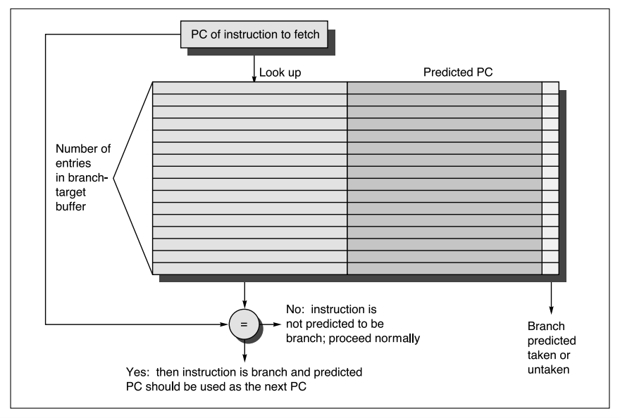
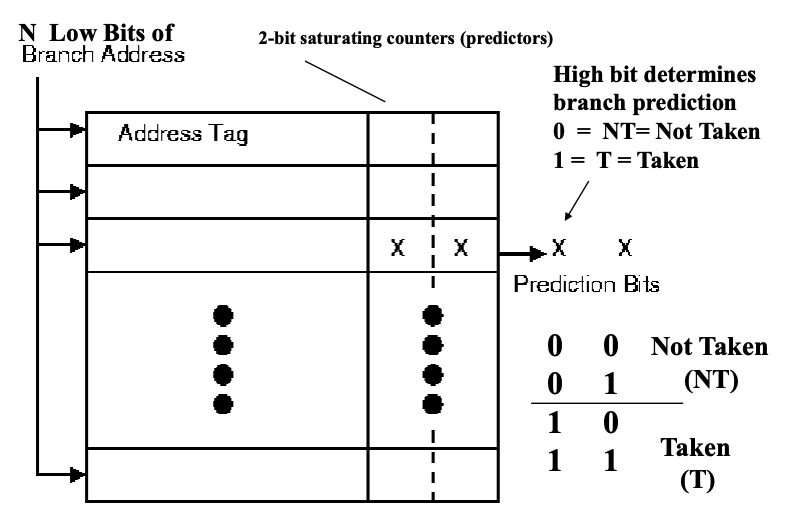

## 分支预测

### 1.一些名词

- ***BTB*** : Branch Target Buffer 分支预测缓冲区，用于记录一条分支指令的跳转地址，由于这儿存储的是指令地址，因此，这个表格不会做的太大。如果BTB有1024个entries，则BTB使用PC的[13:2]作为其索引，因为后两位经常为`00`
- ***BHT*** : Branch History Table 转移历史信息表，用于判断一条分支指令是否**token**；记录的是跳转信息，可以用1bit记录（1跳，0不跳），也可以使用2bit记录，即饱和计数器。通常用指令的后12位作为BHT表格的索引，这样用16Kbit 即可做一个BHT。在***PowerPC 604***中有用，局限是分支索引只能索引一个分支历史信息表。
- ***RAS*** : Return Address Stack 返回地址栈          
- ***BHR*** : Branch History Register  记录最近k条分支的分支结果
- ***PHT*** : Pattern History Table 模式历史信息表，一个分支历史信息表集合。
- ***BHSR*** :  分支历史信息移位寄存器，用于检索***PHT***。




<center>图1. BTB图</center>




<center>图2. BHT图</center>
### 2.分支指令分析


- 对于立即分支指令可用***BTB***精确预测
- 对于返回分支指令可以使用***RAS***精确预测

> 思考：这个图片引自《处理器分支预测研究的历史和现状》——冯子军 肖俊华 章隆兵，统计分析的Spec程序研究得到的，但是不同体系结构的分支类型应该不相同吧，论文中也没有具体说明那种体系结构。


### 3.静态分支预测

- 所有指令都不跳转
- 所有指令都跳转
- 某些指令一律跳转，某些指令一律不跳转
- 与上次跳转结果保持一致：上次跳则跳，上次没跳则不跳
- **BTFN预测(Back Taken, Foreword Not taken)** : 向前的分支跳转，向后的分支不跳转。主要是为了程序中的循环进行优化
- **Profile预测** : 先运行一遍程序，把分支跳转的信息记录下来，然后把这些信息告诉编译器，在此基础上进行编译，通过增加代码来增加程序空间局部性


### 4.动态分支预测

- 1位分支预测

- 2位分支预测

   用BHR来索引PHT，也就是根据我们前面程序分支特性介绍，2级分支预测的基本思想就是用分支的历史模式来索引一个2位分支预测器。

- 饱和计数器（saturating counter）/ 双模态预测器（bimodal predictor）

   

   <center>图3. 两位饱和计数器状态机</center>
> 问：**两位饱和计数器**对分支预测器的结果有什么影响？
   >
   > 答：规定***weakly taken*** 和 ***strongly taken*** 为跳转；***strongly not taken*** 和 ***weakly not taken***不跳转。


但是饱和计数器有一个Bug，例如，每2次执行1次跳转的话，这样饱和计数器就很难预测了，这时候就需要**2级自适应预测器**登场了


- 两级自适应预测器

   2级自适应预测器的一般规则是n为分支历史寄存器，可以预测在所有n周期以内出现的所有重复串行的模式。2级自适应预测器的有点是能快速学会预测任意的重复模式，此方法1991年被提出，已经变得非常流行，以此为基础很多变种方法被用于现代微处理器。

   

- 本地分支预测

   对于每个**条件跳转指令**都有专用的**分支历史情况缓冲区**；模式历史表可以使专用的，也可以是所有条件分支指令专用。

   [Intel](http://zh.wikipedia.org/wiki/Intel) [Pentium MMX](http://zh.wikipedia.org/w/index.php?title=Pentium_MMX&action=edit&redlink=1), [Pentium II](http://zh.wikipedia.org/wiki/Pentium_II), [Pentium III](http://zh.wikipedia.org/wiki/Pentium_III)使用本地分支预测器，记录4位的历史情况，每条条件跳转指令使用专用的本地模式历史表，当然是包含2^4= 16个条目。

   

- 基于历史的分支预测

   利用一个全局历史寄存器去索引一个2位分支预测表

- 全局分支预测

   通过记录分支的前n次历史预测分支，来预测当前分支的输出结果。第一级是一个BHR通过移位记录历史，第二级是一个2位分支预测。

- 局部分支预测

   每个分支指令地址分别记录在一个BHR中，这些BHR就构成了转移历史表（BHT）

   


### 5.一些思考

- 得益于现在分支预测器精度的提升，RISCV中已经取消了延迟槽
- 对于分支预测，我可不可以同时执行两个方向，在最后提交的时候选择一个呢？但是这里有许多问题需要考虑
  - 同时并行执行两条流水线的话，两条流水线后续的指令也要跟进，取指的时候也要同时取两个方向，译码的话也存在两个，这样的话还要访问寄存器。这会不会存在瓶颈
  - 万一处理器在决定分支方向之前又发生了分支怎么办？虚拟分支单元，先暂存起来（类似Tomasolu中的Reservation Station）？或者暂停

- Full Prediction 是啥


### 6.消除分支的一些方法

- conditional moves : ***movz*** , ***movn***

  将原来的分支指令用movz和movn指令简化，例如

  ```C
  // C语言			带分支指令		conditional moves
  if(a < b)		slt	R1,R2,R3	slt R1,R2,R3
      x = a		beq R1,R0,L1	movz R4,R2,R1
  else 			move R4,R2		movn R4,R3,R1
      x = b		j L2
      		L1:	move R4,R3
              L2:
  ```

  但是这是一种比较理想的情况，如果`if...else`之前有成千上百条指令，用conditional moves就很不划算，用带分支指令会比较好一些。

